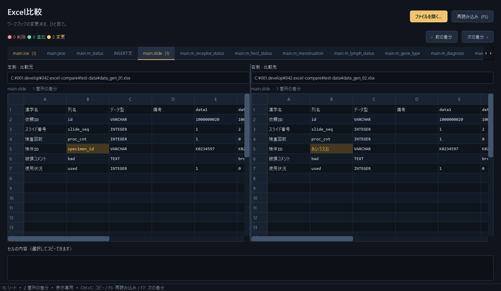

# Excel比較

Python + PySide6製の、表示専用Excel比較アプリです。参考画像に合わせたダークテーマで、2つのファイルを左右に表示します。



## 起動（Windows / Python 3.11以上）

1. 初回のみ `setup.bat` をダブルクリックして依存パッケージをインストールします。
2. `run.bat` をダブルクリックします。
3. 「ファイルを開く…」から、左（比較元）と右（比較先）を指定して「比較」を押します。

PowerShellからも起動できます。

```powershell
python -m venv .venv
.\.venv\Scripts\python.exe -m pip install -r requirements.txt
.\.venv\Scripts\python.exe -m source
# 提供された検証用データで起動
.\.venv\Scripts\python.exe -m source test-data\data_gen_01.xlsx test-data\data_gen_02.xlsx
```

## 機能・比較ルール

- 同じシート名・同じセル位置を比較します。行の挿入・移動を推測して位置を補正する機能はありません。
- 左にだけ値があるセルは赤の「削除」、右にだけ値があるセルは緑の「追加」、両側に異なる値があるセルは黄の「変更」です。左右の同じ位置を色付けします。
- 上部の件数は全シートの合計です。タブにはシートごとの差分セル数を表示し、差分があるシート名を黄色にします。
- シートは左ファイルの順序、その後に右だけのシートを表示します。片側だけのシートは明記し、値のあるセルを追加・削除として数えます。空シートの有無もタブで確認できます（セル差分件数は0）。
- タブを切り替えると左右が同じシートに切り替わります。縦・横スクロール、列幅の変更が同期します。
- 「前の差分」「次の差分」でシートをまたいで移動できます。
- セルまたは矩形範囲を選び、Ctrl+C / 右クリックの「コピー」でコピーできます。下部の内容欄からセル内の一部分も選択・コピーできます。
- 外部のExcelなどで保存してから「再読み込み」を押すと、最新の差分になります。アクティブなシートとスクロール位置を可能な範囲で保持します。
- 元ファイルは短時間の読み取りでメモリへ取り込み、ハンドルを閉じてから解析します。書き込み・保存・排他ロックは行いません。読み込み中も画面が応答します。失敗時は前回の結果を保持します。

| 操作 | キー |
| --- | --- |
| ファイルを開く | Ctrl+O |
| 再読み込み | F5 |
| 次の差分 / 前の差分 | F7 / Shift+F7 |
| 選択セルをコピー | Ctrl+C |

## 対応範囲

- `.xlsx` / `.xlsm` 対応。マクロは実行しません。旧形式 `.xls`、`.xlsb`、パスワード暗号化ファイルは非対応です。
- 空セルと空文字列を空白として扱います。空白文字のみの文字列、数値0、FALSEには値があります。
- 数式は数式文字列を比較・表示します。計算は行わず、保存済み計算結果との比較もしません。
- 文字列と数値、真偽値などの型の違いは差分です。同じ数値の1と1.0は同一です。
- セルの値を簡易グリッドに表示します。Excelの罫線・色・表示形式・列幅・結合表示、図形や画像は再現しません。日付はISO形式、結合セルの値は左上セルに表示します。書式だけの違いは差分にしません。非表示シート・行・列も比較します。
- 1シートの読み込み範囲は500万セルまでです。大量の空セルに書式が付いている場合も制限対象です。ファイルを保存中に再読み込みが失敗した場合は、保存完了後に再実行してください。
- 左右は順番に読み込むため、2ファイル同時の厳密なスナップショットではありません。他アプリ側が読み取りを拒否する場合はアクセスできません。

## 検証

提供データ（15シート）で、`main.irai!G10` と `main.slide!B5` の変更を確認しました。合計は **0 削除・0 追加・2 変更** です。テストは元データを書き換えません。外部保存・再読み込みのテストには一時ファイルを使用します。

```powershell
.\.venv\Scripts\python.exe -m unittest discover -s tests -v
```

## 構成

- `source/core.py`: ファイル読み込み、独立したデータモデル、差分判定。GUIには依存しません。
- `source/gui.py`: ファイル選択画面、読み込みワーカー、セル表示、同期スクロール、コピー。
- `source/__main__.py`: 起動と引数処理。
- `tests/`: 比較ルールとGUIの統合テスト（画面を表示しないモード）。

実装に使用したAPIの参考: [Qtのテーブルモデル](https://doc.qt.io/qtforpython-6/PySide6/QtCore/QAbstractTableModel.html)、[openpyxlの読み取り専用モード](https://openpyxl.readthedocs.io/en/stable/optimized.html)。
